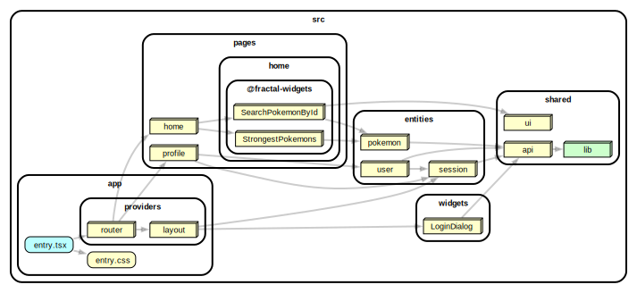

# custom-fractal-sub-slices

> ⚠️ This is an experimental feature that is not included in the current version of the methodology. Read more information in https://github.com/feature-sliced/documentation/discussions/716 .

This example shows how to work with sub slices (or fractal architecture).

[](https://stackblitz.com/github/noveogroup-amorgunov/fsd-lessons/tree/main/packages/custom-fractal-sub-slices)

### Dependency Graph



### How to use

Install deps and then run with npm, Yarn or pnpm to startup the example:

```bash
npm run dev
yarn dev
pnpm dev
```
