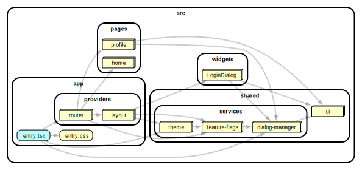

# custom-infrastructure-services

This example shows how to work with infrastructure services. More information in the proposal https://github.com/feature-sliced/documentation/discussions/818 .

[](https://stackblitz.com/github/noveogroup-amorgunov/fsd-lessons/tree/main/packages/react-with-dialog-manager)

### Dependency Graph



### How to use

Install deps and then run with npm, Yarn or pnpm to startup the example:

```bash
npm run dev
yarn dev
pnpm dev
```
