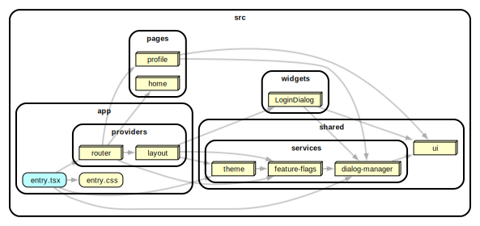
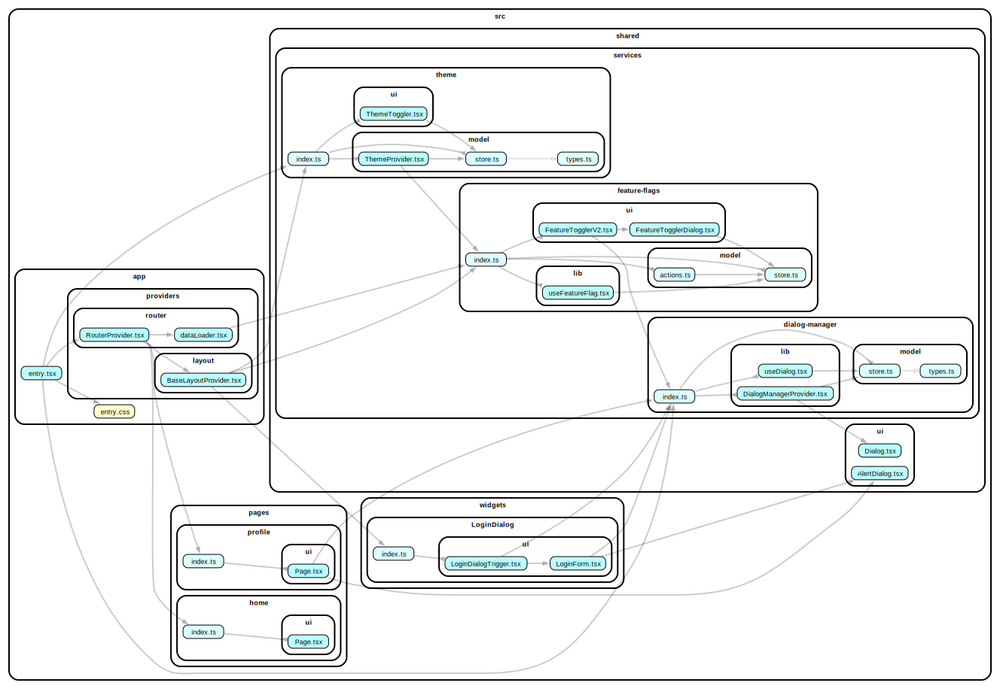

# custom-infrastructure-services

> ⚠️ This is an experimental feature that is not included in the current version of the methodology. Read more information in the proposal https://github.com/feature-sliced/documentation/discussions/818 .

This example shows how to work with infrastructure services.

[](https://stackblitz.com/github/noveogroup-amorgunov/fsd-lessons?file=packages%2Fcustom-infrastructure-services%2FREADME.md&startScript=dev:custom-infrastructure-services)

### Dependency Graph



<details>
<summary>Full dependency graph</summary>


</details>

### How to use

Install deps and then run with npm, Yarn or pnpm to startup the example:

```bash
npm run dev
yarn dev
pnpm dev
```
