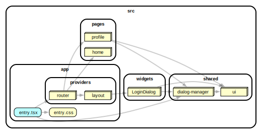

# react-with-dialog-manager

This example shows how to work with dialog (modal) manager.

[](https://stackblitz.com/github/noveogroup-amorgunov/fsd-lessons?file=packages%2Freact-with-dialog-manager%2FREADME.md&startScript=dev:react-with-dialog-manager)

### Dependency Graph



<details>
<summary>Full dependency graph</summary>


</details>

### How to use

Install deps and then run with npm, Yarn or pnpm to startup the example:

```bash
npm run dev
yarn dev
pnpm dev
```
