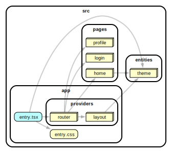
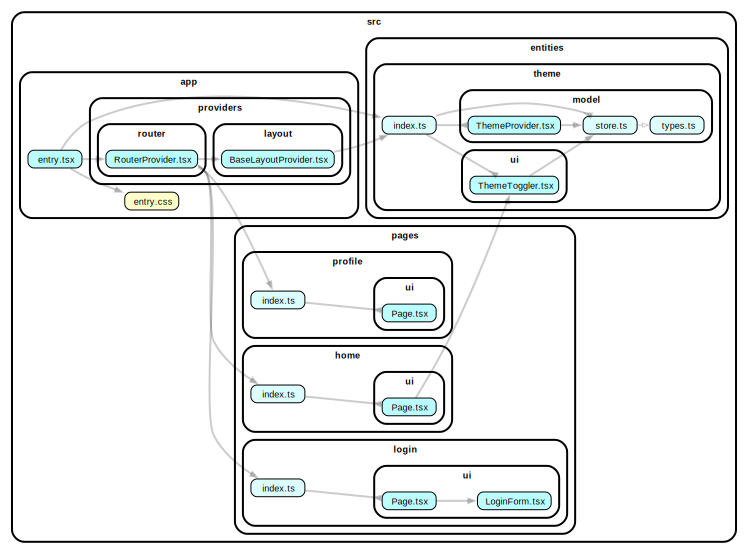

# react-with-theme-toggler

This example shows how to work with theme toggler.

### Preview with StackBlitz

[](https://stackblitz.com/github/noveogroup-amorgunov/fsd-lessons?file=packages%2Freact-with-theme-toggler%2FREADME.md&startScript=dev:theme-toggler)

```bash
# please wait while dependencies are installed...

cd packages/react-with-theme-toggler/

pnpm dev
```

### Dependency Graph



<details>
<summary>Full dependency graph</summary>


</details>

### How to use

Install deps and then run with npm, Yarn or pnpm to startup the example:

```bash
npm run dev
yarn dev
pnpm dev
```
